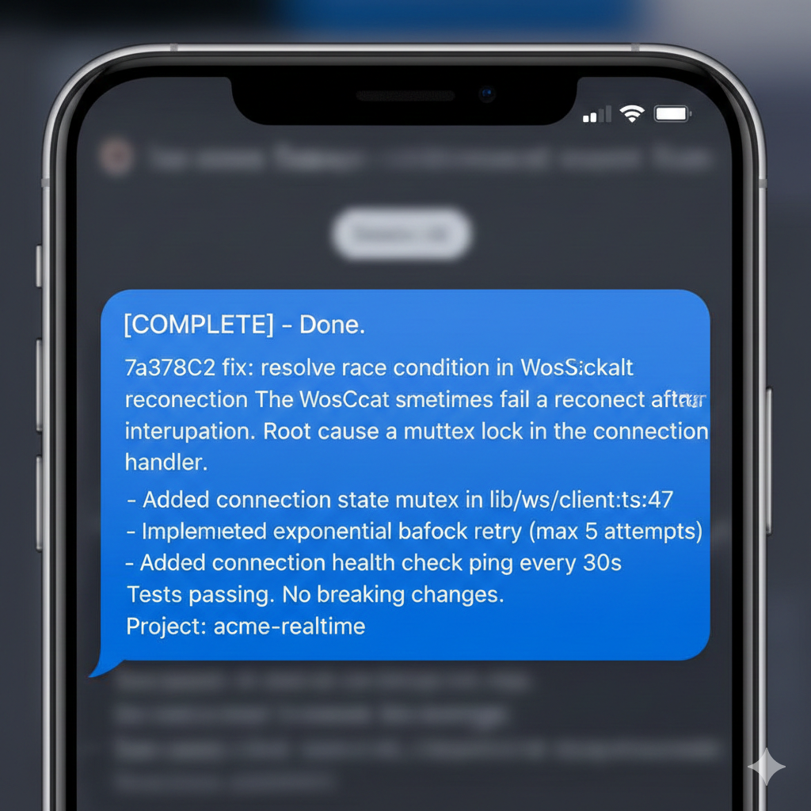

# Claudible

**Async notifications for Claude Code** — Get notified when Claude finishes work, needs input, or stops.

[](https://go.dev/)
[](LICENSE)
[]()

---

## Overview

Claudible transforms Claude Code from a blocking, foreground tool into an **asynchronous, ambient assistant**. Run long tasks, step away, and get notified on your phone or desktop when Claude needs you.

```
Claude Code → Hook Event → Claudible → Your Phone/Desktop
```

### Why Claudible?

- **Work asynchronously** — Start a task, do something else, get pinged when done
- **Never miss Claude waiting** — Know immediately when input is needed
- **Native experience** — iMessage on Mac, push notifications everywhere else
- **Zero Claude Code modifications** — Uses the official hooks system
- **Smart detection** — Optional AI-powered state classification

<p align="center">
  
  <br>
  <em>Get notified on your phone when Claude completes work</em>
</p>

---

## Features

| Feature | Description |
|---------|-------------|
| **Multi-Provider Support** | iMessage, SMS, push notifications, webhooks, desktop alerts |
| **Smart State Detection** | Distinguishes complete/waiting/stopped/idle states |
| **LLM Evaluation** | Optional AI-powered analysis for accurate classification |
| **Transcript Analysis** | Extracts context from Claude's conversation history |
| **Cross-Platform** | macOS, Linux (Windows support planned) |
| **Configurable** | YAML-based configuration with sensible defaults |
| **Extensible** | Easy to add custom notification providers |

---

## Table of Contents

- [Quick Start](#quick-start)
- [Installation](#installation)
- [Configuration](#configuration)
- [Notification Providers](#notification-providers)
- [Claude Code Integration](#claude-code-integration)
- [Smart State Classification](#smart-state-classification)
- [CLI Reference](#cli-reference)
- [Troubleshooting](#troubleshooting)
- [Architecture](#architecture)
- [Contributing](#contributing)
- [License](#license)

---

## Quick Start

### One-Command Setup (macOS with iMessage)

The fastest way to get started on macOS:

```bash
# 1. Install claudible globally
go install github.com/swiftj/claudible/cmd/claudible@latest

# 2. Run the setup wizard
claudible setup
```

That's it! The setup wizard will:
- Ask for your phone number (or Apple ID email)
- Create the configuration file at `~/.config/claudible/config.yaml`
- Add the SessionEnd hook to Claude Code's `~/.claude/settings.json`

You'll start receiving iMessage notifications immediately when Claude Code completes tasks or needs your input.

**Non-interactive setup** (for scripts or automation):

```bash
claudible setup --phone "+15551234567"
```

---

### Manual Setup

For more control or non-macOS platforms:

```bash
# 1. Install
make install

# 2. Create config
mkdir -p ~/.config/claudible
cat > ~/.config/claudible/config.yaml << 'EOF'
notifications:
  default_provider: desktop
  providers:
    desktop:
      enabled: true
behavior:
  notify_on: [complete, waiting]
EOF

# 3. Configure Claude Code hooks (~/.claude/settings.json)
# Add: "hooks": { "SessionEnd": [{ "matcher": "", "hooks": [{ "type": "command", "command": "claudible" }] }] }

# 4. Test it
echo '{"session_id":"test","cwd":"/tmp","transcript_path":"","notification_type":"stop"}' | claudible --dry-run
```

---

## Installation

### Prerequisites

- **Go 1.21+** — [Download Go](https://go.dev/dl/)
- **Claude Code** — [Install Claude Code](https://docs.anthropic.com/claude-code)

### From Source

```bash
# Clone the repository
git clone https://github.com/swiftj/claudible.git
cd claudible

# Build and install
make install

# Verify installation
claudible --version
```

### Build Options

```bash
make build      # Build to ./build/claudible
make install    # Build and install to $GOPATH/bin
make test       # Run all tests
make lint       # Run linter
make clean      # Remove build artifacts
```

### PATH Configuration

If `claudible` isn't found after installation, add Go's bin directory to your PATH:

```bash
# Add to ~/.bashrc, ~/.zshrc, or equivalent
export PATH="$PATH:$HOME/go/bin"
```

---

## Configuration

Claudible uses a YAML configuration file located at `~/.config/claudible/config.yaml`.

### Creating Your Configuration

```bash
# Create config directory
mkdir -p ~/.config/claudible

# Copy example configuration
cp config.example.yaml ~/.config/claudible/config.yaml

# Edit with your settings
$EDITOR ~/.config/claudible/config.yaml
```

### Configuration Reference

```yaml
# ~/.config/claudible/config.yaml

notifications:
  # Default provider when multiple are enabled
  default_provider: imessage

  providers:
    # iMessage via AppleScript (macOS only)
    imessage:
      enabled: true
      target: "+15551234567"  # Phone number or Apple ID email

    # SMS providers (Twilio, Vonage, Plivo)
    sms:
      enabled: false
      provider: twilio        # twilio | vonage | plivo
      from: "+15551234567"    # Your provider number
      to: "+15559876543"      # Destination number
      # Provider-specific credentials (see SMS Providers section)
      account_sid: ""
      auth_token: ""

    # HTTP webhooks (Pushcut, IFTTT, custom)
    http:
      enabled: false
      endpoint: "https://api.pushcut.io/YOUR_KEY/notifications/Claude"
      headers:
        Content-Type: application/json

    # Desktop notifications
    desktop:
      enabled: false

    # Pushover (https://pushover.net)
    pushover:
      enabled: false
      app_token: ""           # Application API token
      user_key: ""            # Your user key
      priority: 0             # -2 to 2 (emergency)

    # Pushbullet (https://pushbullet.com)
    pushbullet:
      enabled: false
      api_key: ""             # Access token
      device_iden: ""         # Optional: specific device

behavior:
  # States that trigger notifications
  notify_on:
    - complete              # Work finished
    - waiting               # Input needed
    # - stopped             # Unexpected stop
    # - idle                # Neutral state

  # Maximum notification message length
  max_message_length: 900

  # Include repository path in messages
  include_repo_path: true

# Optional: LLM-powered state classification
evaluator:
  enabled: false
  provider: anthropic       # anthropic | openai
  api_key: ""               # API key
  model: "claude-3-haiku-20240307"
  max_tokens: 256
```

### Configuration Locations

Claudible searches for configuration in this order:

1. Path specified via `--config` flag
2. `~/.config/claudible/config.yaml`
3. `~/.claudible/config.yaml`
4. `./config.yaml` (current directory)

---

## Notification Providers

### iMessage (macOS)

Send notifications via Apple Messages to your iPhone, iPad, or Mac.

```yaml
providers:
  imessage:
    enabled: true
    target: "+15551234567"  # Phone number OR Apple ID email
```

**Requirements:**
- macOS only
- Messages.app signed in
- Automation permissions granted

**Granting Permissions:**
1. Run Claudible once (it will prompt)
2. Or: System Settings → Privacy & Security → Automation → Allow your terminal to control Messages

**Pro Tip:** Use your own phone number/Apple ID to message yourself.

---

### Desktop Notifications

Native OS notifications — no external service required.

```yaml
providers:
  desktop:
    enabled: true
```

**Platform Support:**
| Platform | Implementation |
|----------|----------------|
| macOS | `osascript` (Notification Center) |
| Linux | `notify-send` (requires libnotify) |
| Windows | Planned |

---

### Pushover

Cross-platform push notifications via [Pushover](https://pushover.net) ($5 one-time purchase).

```yaml
providers:
  pushover:
    enabled: true
    app_token: "azGDORePK8gMaC0QOYAMyEEuzJnyUi"  # Create at pushover.net/apps
    user_key: "uQiRzpo4DXghDmr9QzzfQu27cmVRsG"   # Your user key
    priority: 0  # -2=lowest, -1=low, 0=normal, 1=high, 2=emergency
```

**Setup:**
1. Create account at [pushover.net](https://pushover.net)
2. Install Pushover app on your devices
3. Create an application to get your `app_token`
4. Find your `user_key` on the dashboard

---

### Pushbullet

Cross-platform notifications via [Pushbullet](https://pushbullet.com) (free tier available).

```yaml
providers:
  pushbullet:
    enabled: true
    api_key: "o.1234567890abcdef"  # Settings → Access Tokens
    device_iden: ""                 # Optional: target specific device
```

**Setup:**
1. Create account at [pushbullet.com](https://pushbullet.com)
2. Install browser extension or mobile app
3. Generate access token in Settings

---

### SMS Providers

Send notifications via SMS text message.

#### Twilio

```yaml
providers:
  sms:
    enabled: true
    provider: twilio
    from: "+15551234567"      # Your Twilio number
    to: "+15559876543"        # Destination number
    account_sid: "ACxxxxx"    # Account SID
    auth_token: "xxxxxx"      # Auth Token
```

#### Vonage (Nexmo)

```yaml
providers:
  sms:
    enabled: true
    provider: vonage
    from: "+15551234567"
    to: "+15559876543"
    api_key: "xxxxxx"         # API Key
    api_secret: "xxxxxx"      # API Secret
```

#### Plivo

```yaml
providers:
  sms:
    enabled: true
    provider: plivo
    from: "+15551234567"
    to: "+15559876543"
    auth_id: "xxxxxx"         # Auth ID
    auth_token: "xxxxxx"      # Auth Token
```

---

### HTTP Webhooks

Send notifications to any HTTP endpoint.

```yaml
providers:
  http:
    enabled: true
    endpoint: "https://your-webhook.com/notify"
    headers:
      Content-Type: application/json
      Authorization: "Bearer your-token"
```

**Payload Format:**
```json
{
  "title": "Claude Code",
  "state": "complete",
  "summary": "Implemented feature X",
  "request": "Add caching to API",
  "cwd": "/path/to/repo",
  "session_id": "abc123",
  "timestamp": "2024-01-09T13:45:00Z"
}
```

**Popular Integrations:**
- [Pushcut](https://pushcut.io) — iOS automation
- [IFTTT](https://ifttt.com) — Webhooks service
- [Zapier](https://zapier.com) — Webhooks by Zapier
- [ntfy](https://ntfy.sh) — Self-hosted notifications
- Custom webhooks — Slack, Discord, etc.

---

## Claude Code Integration

Claudible integrates with Claude Code via the **hooks system**.

### Configuring Hooks

Edit `~/.claude/settings.json`:

```json
{
  "hooks": {
    "stop": [
      {
        "type": "command",
        "command": "claudible"
      }
    ]
  }
}
```

### Hook Events

| Event | When It Fires |
|-------|---------------|
| `stop` | Claude stops responding (completion, error, or waiting) |

Claudible analyzes the transcript to determine the actual state (complete vs waiting vs stopped).

### Hook Input Contract

Claude Code passes JSON via stdin:

```json
{
  "session_id": "abc123",
  "cwd": "/path/to/project",
  "transcript_path": "/path/to/transcript.jsonl",
  "notification_type": "stop"
}
```

---

## Smart State Classification

Claudible determines what Claude is actually doing, not just that it stopped.

### States

| State | Meaning | Example |
|-------|---------|---------|
| `complete` | Work finished successfully | "Done! All tests pass." |
| `waiting` | Awaiting user input | "Which option would you prefer?" |
| `stopped` | Execution ended unexpectedly | Error or interruption |
| `idle` | Neutral waiting state | No clear signal |

### Heuristic Classification

By default, Claudible uses pattern matching on the transcript:

- **Complete indicators:** "done", "finished", "implemented", "tests pass"
- **Waiting indicators:** Questions, "please provide", "which option"
- **Error indicators:** Stack traces, "error", "failed"

### LLM-Powered Classification (Optional)

For more accurate detection, enable AI-powered evaluation:

```yaml
evaluator:
  enabled: true
  provider: anthropic       # or: openai
  api_key: "sk-ant-..."
  model: "claude-3-haiku-20240307"  # Fast and cheap
  max_tokens: 256
```

The evaluator analyzes the last exchange and returns:

```json
{
  "state": "complete",
  "summary": "Implemented caching layer with Redis",
  "confidence": 0.95
}
```

**Supported Providers:**
- **Anthropic:** claude-3-haiku, claude-3-sonnet, claude-3-opus
- **OpenAI:** gpt-4o-mini, gpt-4o, gpt-4-turbo

---

## CLI Reference

```
claudible [flags]              Process hook input from stdin
claudible setup [flags]        Interactive setup wizard

Flags:
  --config string   Custom config file path
  --dry-run         Parse and classify but don't send notifications
  --verbose         Enable verbose logging
  --version         Print version and exit
  --help            Show help

Setup Flags:
  --phone string    Phone number for iMessage (skip interactive prompt)
  --verbose         Enable verbose output
```

### Examples

```bash
# Interactive setup (recommended for first-time users)
claudible setup

# Non-interactive setup with phone number
claudible setup --phone "+15551234567"

# Normal operation (called by Claude Code hooks)
claudible

# Dry run with verbose output
echo '{"session_id":"x","cwd":"/tmp","transcript_path":"","notification_type":"stop"}' \
  | claudible --dry-run --verbose

# Use custom config
claudible --config /path/to/config.yaml

# Check version
claudible --version
```

### Exit Codes

| Code | Meaning |
|------|---------|
| 0 | Success (including notification failures — best-effort delivery) |
| 1 | Configuration or parsing error |

---

## Troubleshooting

### Common Issues

#### "claudible: command not found"

Ensure Go's bin directory is in your PATH:

```bash
export PATH="$PATH:$HOME/go/bin"
```

Add to your shell profile (`~/.zshrc`, `~/.bashrc`) for persistence.

#### No notifications received

1. **Check provider is enabled:**
   ```yaml
   providers:
     imessage:
       enabled: true  # Must be true
   ```

2. **Verify configuration:**
   ```bash
   claudible --dry-run --verbose
   ```

3. **Check state filter:**
   ```yaml
   behavior:
     notify_on:
       - complete
       - waiting  # Include states you want
   ```

#### iMessage not working (macOS)

1. **Grant automation permissions:**
   - System Settings → Privacy & Security → Automation
   - Allow your terminal app to control Messages.app

2. **Verify Messages.app is signed in:**
   - Open Messages.app
   - Ensure you're logged into iMessage

3. **Test manually:**
   ```bash
   osascript -e 'tell application "Messages" to send "Test" to buddy "+15551234567"'
   ```

#### Hook not firing

1. **Verify settings.json syntax:**
   ```bash
   cat ~/.claude/settings.json | jq .
   ```

2. **Check hook configuration:**
   ```json
   {
     "hooks": {
       "stop": [{"type": "command", "command": "claudible"}]
     }
   }
   ```

3. **Ensure claudible is in PATH** when Claude Code runs

### Debug Mode

Use verbose mode for detailed diagnostics:

```bash
echo '{"session_id":"debug","cwd":"/tmp","transcript_path":"","notification_type":"stop"}' \
  | claudible --verbose
```

Output includes:
- Configuration source
- Hook input parsing
- State classification
- Provider dispatch

---

## Architecture

```
┌─────────────────────────────────────────────────────────────┐
│                        Claude Code                          │
└─────────────────────────┬───────────────────────────────────┘
                          │ Hook Event (stdin JSON)
                          ▼
┌─────────────────────────────────────────────────────────────┐
│                        Claudible                            │
│  ┌───────────────┐  ┌────────────────┐  ┌───────────────┐   │
│  │  Hook Parser  │→ │ State Classify │→ │    Router     │   │
│  │ (stdin JSON)  │  │ (Heuristic/LLM)│  │ (Providers)   │   │
│  └───────────────┘  └────────────────┘  └───────────────┘   │
│          │                   │                   │          │
│          ▼                   ▼                   ▼          │
│  ┌───────────────┐  ┌────────────────┐  ┌───────────────┐   │
│  │  Transcript   │  │   Evaluator    │  │   Provider    │   │
│  │    Parser     │  │ (Optional LLM) │  │   Registry    │   │
│  └───────────────┘  └────────────────┘  └───────────────┘   │
└─────────────────────────────────────────────────────────────┘
                          │
          ┌───────────────┼───────────────┐
          ▼               ▼               ▼
    ┌──────────┐   ┌──────────┐   ┌──────────┐
    │ iMessage │   │   SMS    │   │  HTTP/   │
    │ Desktop  │   │ Pushover │   │ Webhook  │
    │          │   │Pushbullet│   │          │
    └──────────┘   └──────────┘   └──────────┘
```

### Directory Structure

```
claudible/
├── cmd/claudible/          # CLI entry point
│   └── main.go
├── internal/
│   ├── config/             # YAML configuration
│   ├── hook/               # Stdin JSON parsing
│   ├── transcript/         # JSONL transcript parsing
│   ├── state/              # State classification
│   ├── evaluator/          # LLM-based evaluation
│   ├── router/             # Notification orchestration
│   ├── notification/       # Message types
│   ├── setup/              # Setup wizard for one-command install
│   └── providers/          # Notification backends
│       ├── imessage/       # AppleScript iMessage
│       ├── sms/            # Twilio, Vonage, Plivo
│       ├── http/           # Webhooks
│       ├── desktop/        # OS notifications
│       ├── pushover/       # Pushover API
│       └── pushbullet/     # Pushbullet API
├── config.example.yaml     # Example configuration
├── Makefile                # Build automation
└── README.md               # This file
```

---

## Contributing

Contributions are welcome! Please read our contributing guidelines before submitting PRs.

### Development Setup

```bash
# Clone
git clone https://github.com/swiftj/claudible.git
cd claudible

# Install dependencies
go mod download

# Run tests
make test

# Run linter
make lint

# Build
make build
```

### Adding a New Provider

1. Create `internal/providers/yourprovider/provider.go`
2. Implement the `notification.Provider` interface:
   ```go
   type Provider interface {
       Name() string
       Enabled() bool
       Send(ctx context.Context, msg *Message) error
   }
   ```
3. Register in `internal/router/router.go`
4. Add configuration in `internal/config/config.go`
5. Update `config.example.yaml`
6. Add tests

### Running Tests

```bash
make test           # All tests
make test-race      # With race detector
go test -v ./...    # Verbose output
```

---

## License

MIT License — see [LICENSE](LICENSE) for details.

---

## Acknowledgments

- Built for the [Claude Code](https://docs.anthropic.com/claude-code) hooks system
- Inspired by the need to work asynchronously with AI assistants

---

<p align="center">
  <strong>Never miss when Claude needs you.</strong>
</p>
